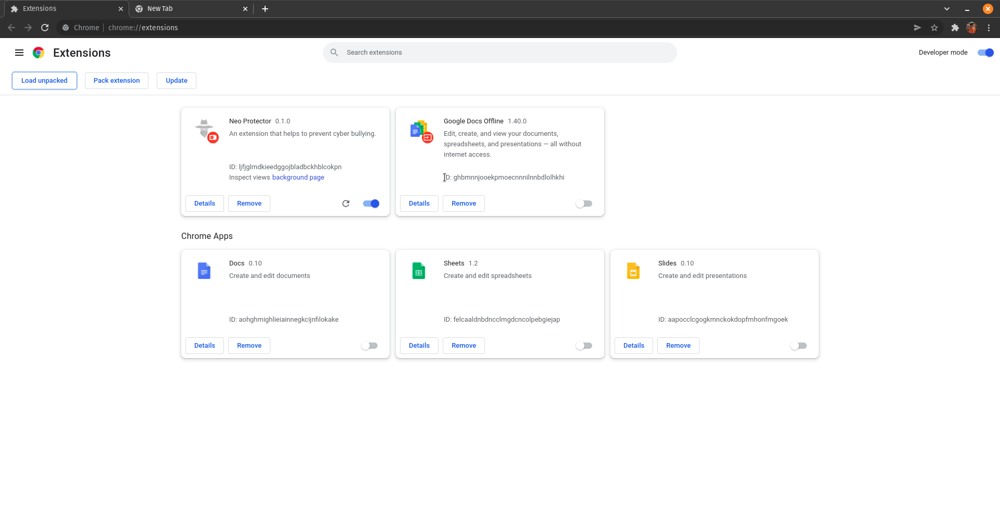
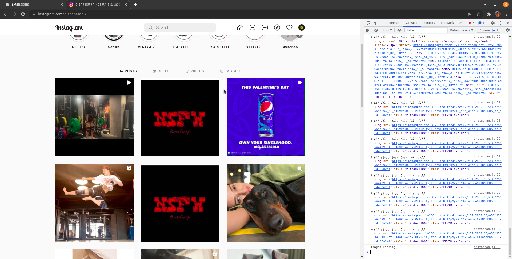
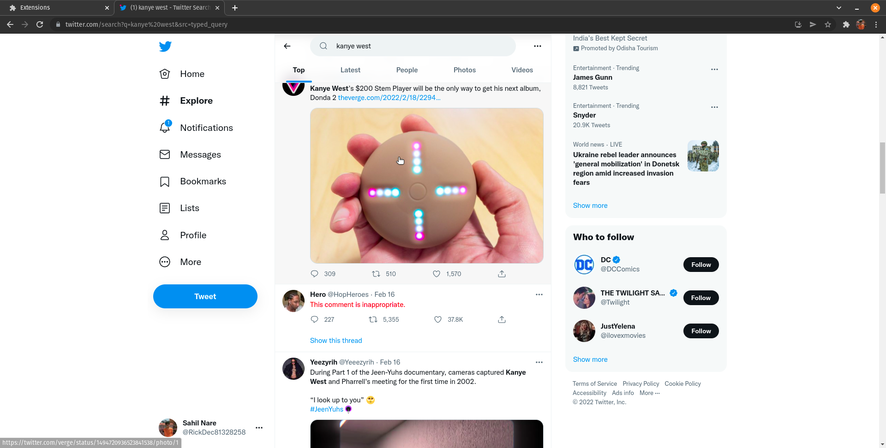
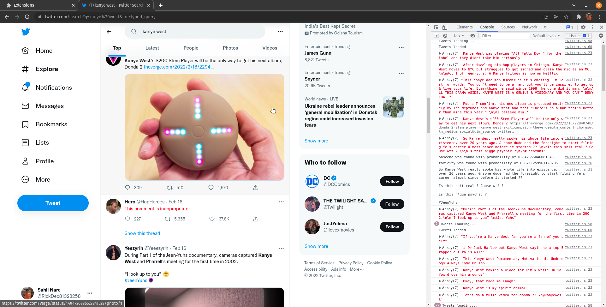
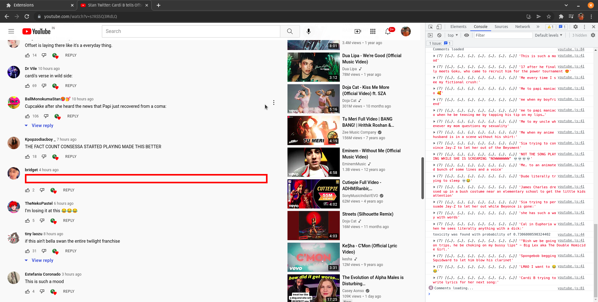
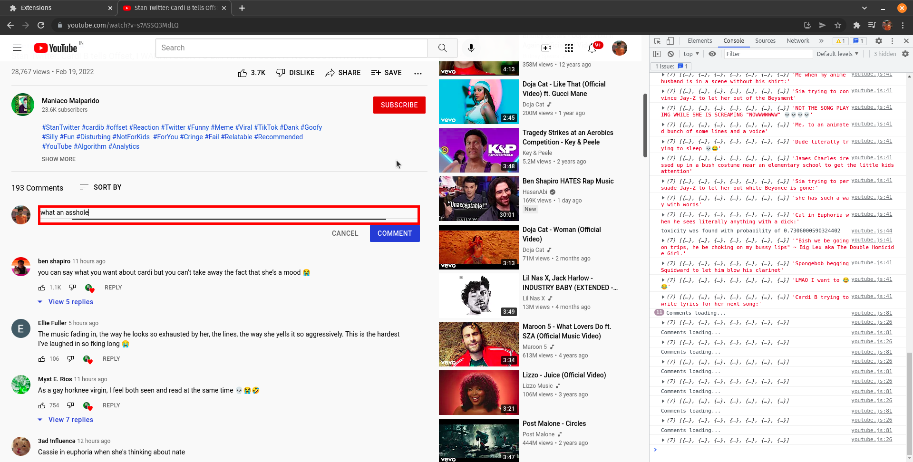

# TechnoHack2022
Project submission by Team That's What C Said
# NeoProtector
NeoProtector is an all-in-one integrated solution for prevention of cyber-crimes like cyber bullying/harassment, etc. We have built a web-extension which will automatically detect cyberbullying from social media platform, hide it from the users and report it to the respective authority. This will help in reducing the cyber-crime in India and will make Internet a safe place for everyone.

## I) WEB EXTENSION

### Installation:
1. Clone the repo.
2. Go to Chrome Browser and search chrome://extensions.
3. Enable Developer mode on top-right corner.
4. Click on Load unpacked and select 'web_ext' folder from the repo.
5. Now the Web Extension is loaded.

## IV) Deeplearning Model
1.For toxic comment removal:\
model architecture : Universal Sentence Encoder\
class : toxic, severe- toxic, obscene ,threat ,insult, identity-hate, sexual explicit\
2.For inappropiate image classification:\
model architecture : mobilenet\
class : Porn , Hentai , Sexy , Neutral , drawing

## Demo Images

  

